<div align="center">
  
</div>

<div align="center">
  <sub><i>"Believe in yourself."</i></sub>
</div>

<br/>

<div align="center">
  <code>&gt; ACCESSING FILE... GRANTED</code>
</div>

<br/>

## `[ USER_FILE // APRESENTAÇÃO ]`

Olá! Eu sou o **Pedro Gabriel**, um estudante de tecnologia do Brasil, atualmente concluindo o curso técnico de **Manutenção e Suporte em Informática**.

Estou no início da minha jornada como **Beginner Full Stack Developer** — ainda aprendendo, ainda errando, ainda ajustando o processo. Não sou especialista em nada aqui, e é exatamente por isso que esse perfil existe: para registrar essa evolução.

Também me considero um **Vibe Coder** — desenvolvo pensando em experiência, estrutura e sensação do projeto tanto quanto no código em si, usando ferramentas de IA como apoio ao longo do caminho (mais sobre isso lá embaixo).

- 🎓 Formando em **Manutenção e Suporte em Informática**
- 💻 **Beginner Full Stack Developer**
- 🎯 Objetivo de longo prazo: **Software Engineer**
- 🇧🇷 Brasil

---

## `[ LOG_HISTORY // TRAJETÓRIA E OBJETIVO ]`

```
[2024-2026] Curso técnico em Manutenção e Suporte em Informática
[ATUAL]     Beginner Full Stack Developer — construindo projetos reais
[OBJETIVO]  Software Engineer
```

Meu foco agora é sair da teoria e colocar a mão na massa: entender como um projeto nasce, se estrutura e evolui — não só escrever código que funciona, mas entender *por que* ele funciona daquele jeito.

---

## `[ SYS.STACK // TECNOLOGIAS ]`

<div align="center">


</div>

> Ainda estou estudando a maioria dessas tecnologias — essa lista é um retrato do meu aprendizado atual, não um currículo de especialista.

---

## `[ ARCHIVE // PROJETOS EM DESTAQUE ]`

### 🔶 Library Hub `[PROJETO PRINCIPAL]`

Acervo digital / biblioteca escolar desenvolvido para a minha escola. Meu projeto mais completo até agora, focado em organização de conteúdo e usabilidade para o ambiente escolar.

`STATUS // EM DESENVOLVIMENTO`&nbsp;&nbsp;&nbsp;[🔗 Repositório](https://github.com/pedrogabriel18-dev/library-hub)

---

<table>
<tr>
<td width="50%" valign="top">

**🖥️ Kayron Technology**

Site fictício de uma empresa de tecnologia militar, com estética corporativa e tecnológica.

`HTML` `CSS` `JavaScript`

[🔗 Repositório](https://github.com/pedrogabriel18-dev/kairon-technology)

</td>
<td width="50%" valign="top">

**🦎 EcoSeridó**

Catálogo digital de animais ameaçados e extintos da Caatinga e do Nordeste brasileiro, com foco em organização e apresentação de dados.

[🔗 Repositório](https://github.com/pedrogabriel18-dev/ecoserido)

</td>
</tr>
<tr>
<td width="50%" valign="top">

**⚙️ Gerador de Nome Militar**

Aplicação em JavaScript que gera nomes de código militares de forma automatizada.

`JavaScript`

[🔗 Repositório](https://github.com/pedrogabriel18-dev/gerador-de-nome-militar)

</td>
<td width="50%" valign="top">

<sub>Mais projetos em construção — esse espaço cresce junto comigo. 🚧</sub>

</td>
</tr>
</table>

---

## `[ PROCESS.LOG // VIBE CODING — MEU PROCESSO ]`

Uso ferramentas de IA como parte do meu fluxo de desenvolvimento — principalmente **Anti-Gravity**, **Gemini**, **ChatGPT** e **Claude / Claude Code**. Mas elas são copilotos, não autopilotos.

O que continua sendo trabalho meu em cada projeto:

```
[✓] Planejamento e definição do escopo
[✓] Arquitetura e escolha de tecnologias
[✓] Implementação e lógica das funcionalidades
[✓] Testes e correção de erros
[✓] Deploy
[✓] Documentação
[✓] Evolução e manutenção do projeto
```

A IA me ajuda a escrever mais rápido e a entender conceitos novos. Quem decide *o que* construir, *como* estruturar e *por que* aquela solução faz sentido continuo sendo eu.

---

## `[ COMMS // CONTATO ]`

<div align="center">

[](https://github.com/pedrogabriel18-dev)
[](https://www.linkedin.com/in/pedrogabriel18dev)
[](https://www.instagram.com/_pedrog18)
[](mailto:contato.pedrogabriel@gmail.com)

</div>

---

<div align="center">

`STATUS // LEARNING` &nbsp;•&nbsp; `OBJECTIVE // SOFTWARE ENGINEER`

### *"Believe in yourself."*

<sub><code>&gt; END OF FILE</code></sub>

</div>
